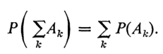

# 保留預留

# 数据结构

## 保留

## 时间复杂度计算

### 的地方的地方
   *
   * 参考
   * 视频
   * 知识点总结
      + 时间复杂度
        - 参考
           
   * 作业练习
      +
   * 实验
      + 实验1 - 关于。。。的实验
         - 作业
            1. [exp1-1.cpp](./04_Practice/Test_20200302/05_SourceCode/exp1-1
            2.[练习1.2.2](https://mooc1-1.chaoxing.com/mycourse/studentstudy?chapterId=248409102&courseId=208441200&clazzid=17073409&enc=b2e1e65b2a934fdd07ec631bb615632d) -  
            
         - 参考
         - 源代码
           :one:<>   
   * Sourcecode
      + [dafaf](dfaf) 
      +  
